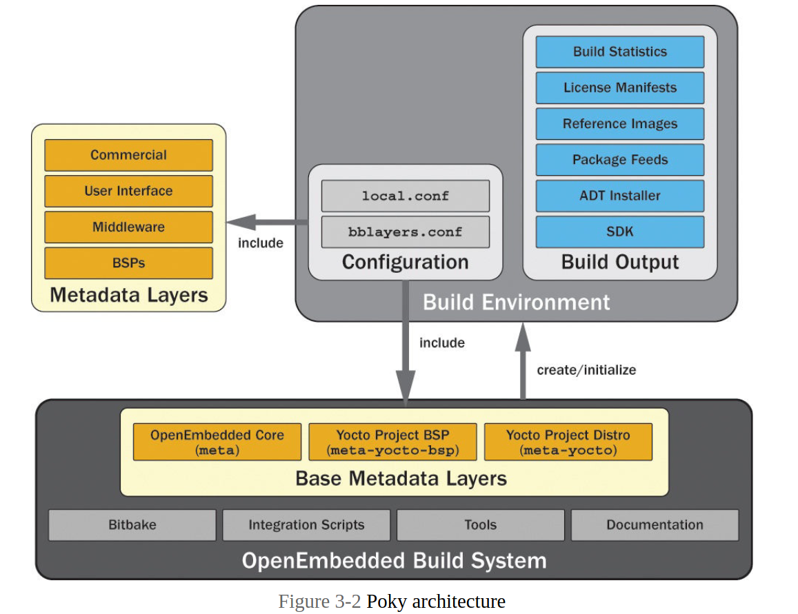

## OpenEmbedded Build System Architecture
Three base components make up the OpenEmbedded build system architecture:
* Build system
* Build environment
* Metadata layers

Figure below depicts the components and their relationship to each other.

### Components of the OpenEmbedded Build System
The OpenEmbedded build system provides all of the necessary components, other than a few additional software packages that come with any Linux distribution, for building embedded Linux OS stacks. Included are the BitBake build engine; a set of integration scripts that provide additional functionality for convenience; various tools; OE Core, the core set of metadata required by BitBake to build images; and the entire documentation set in DocBook format. The Poky reference distribution also includes a minimum set of base metadata layers: Yocto Project BSP (meta-yocto-bsp) and Yocto Project Distribution (meta-yocto).

#### components:
1. **BitBake Build Engine**:
   - **BitBake** is the central build engine used by the OpenEmbedded build system. It processes recipes and orchestrates the build process to compile, assemble, and package software.

2. **Integration Scripts**:
   - These are additional scripts provided by the OpenEmbedded build system to enhance functionality and convenience during the build process. They might handle tasks such as environment setup, build configuration, or custom build steps.

3. **Various Tools**:
   - The build system includes a variety of tools necessary for building embedded Linux OS stacks. These tools assist in tasks like cross-compilation, image creation, and package management.

4. **OE Core (OpenEmbedded Core)**:
   - OE Core is the core set of metadata that BitBake requires to build images. This metadata includes recipes, configuration files, and classes that define how software packages are built and integrated into the final image.

5. **Documentation Set in DocBook Format**:
   - The entire documentation for the OpenEmbedded build system is provided in DocBook format, a standard for writing structured documents. This documentation helps users understand and use the build system effectively.

### Poky Reference Distribution

The Poky reference distribution is an example distribution provided by the Yocto Project. It includes a minimum set of base metadata layers required to build a functional embedded Linux distribution:

1. **Yocto Project BSP (meta-yocto-bsp)**:
   - **BSP** stands for Board Support Package. The `meta-yocto-bsp` layer includes metadata and configurations for supporting various hardware platforms. It provides the necessary information for configuring and building the kernel and other hardware-specific components.

2. **Yocto Project Distribution (meta-yocto)**:
   - The `meta-yocto` layer contains the core set of metadata for the Yocto Project distribution itself. This includes recipes and configurations for building the essential components of a Linux distribution, such as the kernel, libraries, and basic utilities.

### Summary

The OpenEmbedded build system, a key part of the Yocto Project, provides all the necessary components for building embedded Linux OS stacks:

- **BitBake Build Engine**: The core build engine for processing recipes and managing the build process.
- **Integration Scripts**: Additional scripts for enhancing functionality and convenience.
- **Various Tools**: Tools needed for cross-compilation, image creation, and package management.
- **OE Core**: Core set of metadata required by BitBake to build images.
- **Documentation Set**: Comprehensive documentation in DocBook format.

The Poky reference distribution includes:

- **Yocto Project BSP (meta-yocto-bsp)**: Metadata and configurations for supporting various hardware platforms.
- **Yocto Project Distribution (meta-yocto)**: Core set of metadata for building the essential components of a Linux distribution.

Together, these components form a complete and powerful build system for developing and deploying embedded Linux systems.

**NOTE:** the script `oe-init-build-env` creates and initializes the build environment. This script is one of the scripts contained within the build system. **A build system and build environments form a 1:n relationship**: a build system can be associated with any number of build environments, but a build environment can be associated with only one build system.
