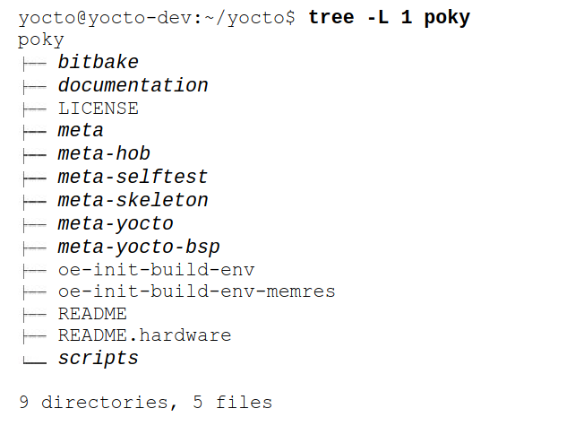

## Build System Structure

Whether you download the Poky distribution in the form of a tarball and extract it or you directly clone it from the Yocto Project Git repository, it installs as a simple structure consisting of directories and files in a single directory similar the following image (the directory names are italicized to distinguish them from the filenames):




Because the OpenEmbedded build system is mostly self-contained and does not install any of its components into the system directories of your build host, it is rather easy to use multiple versions of the build system with different build environments on the same build host. This is a very convenient feature because you eventually develop and maintain a product generation with one version of the build system while developing the next generation with a newer version to take advantage of new functionality and features.

* BitBake, the build engine, is an integral part of the OpenEmbedded build system.

* BitBake is included with the build system, and you can find it in the bitbake subdirectory

### Explanation and Example: Uninstalling Distribution's BitBake Package

#### Key Points

1. **BitBake Version Compatibility**:
   - BitBake, the build engine used by the Yocto Project, is tightly coupled with the rest of the build system. The version of BitBake included with the build system is specifically matched to the other components and metadata used in the build process.

2. **Potential Issues with Pre-installed BitBake**:
   - Some Linux distributions offer a BitBake package that can be installed via the distribution's package manager (e.g., `apt`, `yum`, `dnf`).
   - If this pre-installed version of BitBake is used instead of the version provided by the Yocto Project build system, it might lead to compatibility issues, causing build failures or unexpected behavior.

3. **Recommendation**:
   - It is recommended to uninstall any BitBake package installed via the Linux distribution's package manager to avoid interference with the version included in the Yocto Project build system.

#### Example Scenario

##### Step-by-Step Illustration

1. **Pre-installed BitBake on a Linux Distribution**

   Assume you are using Ubuntu and have installed BitBake using the package manager:
   ```sh
   sudo apt-get install bitbake
   ```

2. **Potential Conflict**

   Your development host now has a version of BitBake installed, e.g., version 1.46.

3. **Cloning the Yocto Project**

   You clone the Yocto Project repository, which includes its own version of BitBake, say version 1.48:
   ```sh
   git clone git://git.yoctoproject.org/poky
   cd poky
   ```

4. **Initializing the Build Environment**

   You initialize the build environment, which is designed to use BitBake version 1.48 from the Yocto Project:
   ```sh
   source oe-init-build-env
   ```

5. **Potential Interference**

   If the system’s PATH prioritizes the pre-installed BitBake version 1.46, it will be used instead of the Yocto Project’s version 1.48:
   ```sh
   which bitbake
   /usr/bin/bitbake  # This is the pre-installed version from the package manager
   ```

6. **Build Failure**

   Running the build process with the wrong version of BitBake can lead to errors due to mismatched features, syntax, or dependencies:
   ```sh
   bitbake core-image-minimal
   # Potential error output indicating version incompatibility
   ```

#### Solution

##### Uninstalling the Pre-installed BitBake

1. **Uninstall the Pre-installed BitBake**

   Remove the BitBake package installed via the package manager:
   ```
   sudo apt-get remove bitbake
   ```

2. **Verify Removal**

   Ensure that the pre-installed BitBake has been removed:
   ```
   which bitbake
   # No output or points to the version in the Yocto Project directory
   ```

3. **Use Yocto Project’s BitBake**

   The build environment now uses the correct BitBake version bundled with the Yocto Project:
   ```sh
   source oe-init-build-env
   which bitbake
   /path/to/poky/bitbake/bin/bitbake  # This is the correct version
   ```

4. **Build Successfully**

   Proceed with the build process using the compatible version of BitBake:
   ```
   bitbake core-image-minimal
   # Build process runs successfully with the correct version of BitBake
   ```

#### Summary

Using the version of BitBake included with the Yocto Project build system ensures compatibility and prevents build failures. If your development host has a pre-installed BitBake from your Linux distribution, it is recommended to uninstall it to avoid conflicts. This ensures that the build process uses the correctly matched version of BitBake, leading to a smooth and error-free build.

### Licensing and Metadata Layers in the Yocto Project

#### Key Points

1. **Difference in Licensing**:
   - **Source Code Licensing**: The license under which the actual source code of a package is released (e.g., GPL, MIT, Apache).
   - **Metadata (Recipe) Licensing**: The license under which the metadata (recipes) that build the package are released. This metadata includes instructions for fetching, configuring, building, and packaging the source code.
   - It is crucial to distinguish between these two types of licensing because they can have different legal and compliance implications for the product being developed.

2. **Implications for Development**:
   - **Source Code**: The license of the source code dictates how the code can be used, modified, and redistributed.
   - **Metadata**: The license of the metadata influences how the build instructions can be used, shared, and modified.
   - Developers must ensure compliance with both licenses to avoid legal issues and to adhere to open-source licensing requirements.

#### Metadata Layers

The Yocto Project organizes its metadata into layers, each starting with the prefix `meta`. These layers contain the recipes, configuration files, and other metadata necessary to build different components of an embedded Linux system. Here are some key layers and their purposes:

1. **meta: OE Core Metadata Layer**:
   - **OE Core**: The core metadata layer for OpenEmbedded. It contains the fundamental recipes, classes, and configurations required to build a basic embedded Linux system.

2. **meta-hob: Metadata Layer for Hob**:
   - **Hob**: A graphical user interface for BitBake, designed to simplify the process of creating custom images. The `meta-hob` layer includes metadata specific to the Hob interface.

3. **meta-selftest: Layer for Testing BitBake**:
   - **Self-Testing**: Contains tests and scripts used to verify the functionality of BitBake and the overall build system. It is used by the `oe-selftest` script to ensure the integrity of the build environment.

4. **meta-skeleton: Template Layer**:
   - **Template**: Provides a starting point for creating custom layers. It includes example recipes and configurations that developers can modify to suit their needs.

5. **meta-yocto: Yocto Project Distribution Layer**:
   - **Distribution**: Contains metadata for the Yocto Project reference distribution. It includes recipes and configurations to build a complete Linux distribution tailored for embedded systems.

6. **meta-yocto-bsp: Yocto Project BSP Layer**:
   - **BSP (Board Support Package)**: Includes metadata for supporting various hardware platforms. This layer provides the necessary configurations and recipes to build the kernel and other hardware-specific components for supported boards.

### Example Scenario

#### Licensing Implications

1. **Source Code License Example**:
   - A package's source code is licensed under the GPL (General Public License). This means any modifications to the source code must also be distributed under the GPL.

2. **Metadata License Example**:
   - The recipe for building this package is licensed under the MIT License. This means the recipe can be freely used, modified, and shared, provided that the original license and copyright notice are retained.

#### Compliance Scenario

- **Product Development**: You are developing a product using the Yocto Project. You must ensure that you comply with the GPL requirements for the source code (e.g., providing source code to end users) and adhere to the MIT License terms for the recipe metadata.

#### Using Metadata Layers

1. **meta Layer**:
   - This is the core layer you use to build the fundamental parts of your system. It contains essential recipes and configurations.

2. **meta-hob Layer**:
   - If you are using the Hob GUI to create custom images, you include this layer to enable Hob-specific features and functionalities.

3. **meta-selftest Layer**:
   - During development, you use this layer to run self-tests on BitBake and ensure your build system is functioning correctly.

4. **meta-skeleton Layer**:
   - To create your own custom layer, you start with `meta-skeleton` as a template, modifying its example recipes and configurations to suit your needs.

5. **meta-yocto and meta-yocto-bsp Layers**:
   - These layers are included to build the Yocto Project reference distribution and support specific hardware platforms required for your product.

### Summary

- **Licensing**: Be aware of the difference between source code licensing and metadata (recipe) licensing to ensure compliance with both.
- **Metadata Layers**: The Yocto Project uses various `meta` layers to organize recipes, configurations, and other metadata necessary for building embedded Linux systems.
- **Practical Use**: Understanding and correctly using these layers and licenses is crucial for successful and legally compliant product development using the Yocto Project.
